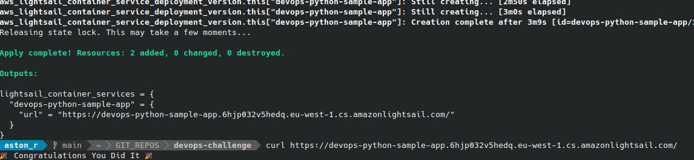

# Notes

- I tried to use the private ECR repository, but there is no way to activate the Amazon ECR image puller IAM role via terraform, 
  so I used public. This is not a good approach, but I decided not to spend time inventing the workaround since there were no requirements regarding this point.

- It is possible to build/push the image using terraform docker provider, but I faced the [issue](https://github.com/kreuzwerker/terraform-provider-docker/issues/468) 
  with this provider, and I did not want to use terraform provisioner to clone repo, so I decided to create the simple bash script.

- I think it would be better to use at least AWS App Runner instead of AWS LightSail.

- To deploy the stack, I created the simple bash script: `ci-cd/deploy.sh`

